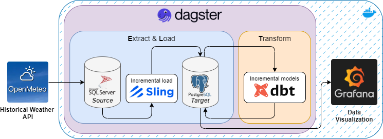
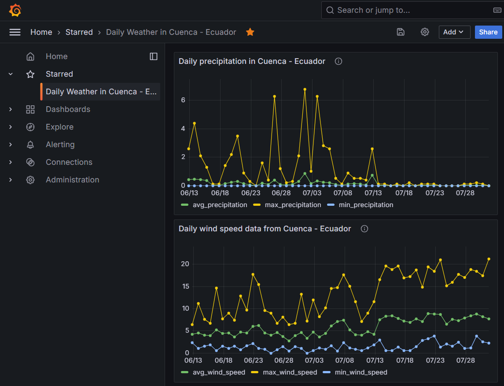
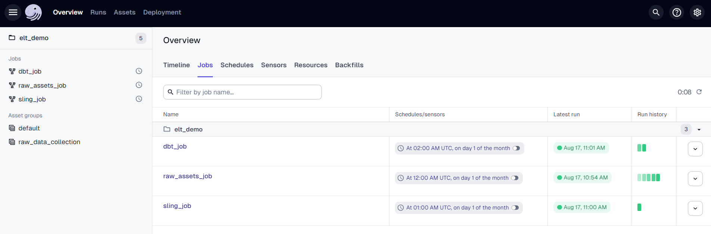

# Extract, Load & Transform demo

For this ELT architecture demo I've used Sling, dbt and Dagster. This project shows the power of combining different technologies to achieve a robust solution for data integration and processing.

For this demo I'm using weather data for Cuenca city in Ecuador, but you can change it to your own by modifing coordinates in the `elt_demo\assets\constants.py` file.



This is how it works, in short:

1. Collect hourly data from Open Meteo Historical Weather API using a [Dagster](https://dagster.io) monthly partition. Selected variables are temperature, relative humidity, precipitation and wind speed.
2. Save collected data in a SQL Server database. This will be used as our source of raw data.
3. **E**xtract raw data from SQL Server source and **L**oad it to a PostgreSQL target database. For this step we use a [Sling](https://slingdata.io) incremental load.
4. **T**ransform the raw data to daily and monthly agregations for each metheorologic variable. For this step we use [dbt](https://docs.getdbt.com) incremental models

As an aditional step I've used a [Grafana](https://grafana.com) dashboard to show the transformed data of each weather variable. At http://localhost:3001 user and passwords are 'admin'.

If you're running on Linux, grant writing permissions to the `grafana-storage` directory.



Finally, this entire ELT architecture was build using [Docker](https://www.docker.com/) containers, so it can be easily rebuild on other systems.

# Try it!

First, clone this repo.

```
git clone https://github.com/darespinoza/elt_demo.git
```

Then, start it.

```
docker compose up -d
```

And that's it! You're ready to go!

## How to use it

Navigate to Dagster's UI at http://localhost:5000/overview/jobs

1. Materialize the `raw_assets_job` to populate the SQL Server source database with hourly data from Open Meteo Historical Weather API.
2. Materialize the `sling_job` to **E**xtract raw data from the source database and **L**oad it to the PostgreSQL target database.
3. Materialize the `dbt_job` to run incremental models using raw data.

Each job has a schedule, wich you can activate to run them automatically.


